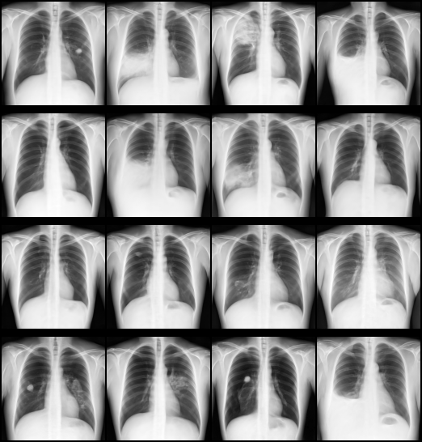

# Diffusion Model (pixel space) — FLIP tutorial

This tutorial trains a **`DiffusionModelUNet` that denoises images directly** — diffusion in pixel
space, with no autoencoder in the loop — on 2-D chest X-rays, using the **NVFLARE Client API**
(`nvflare.client`). The job is defined entirely in Python via `FlipFedAvgRecipe` — no hand-written
JSON configs required. The code is entirely based on `MONAI` functions.

It is one of three tutorials that between them cover generative image synthesis on FLIP:

| Tutorial | Trains | Operates on | Needs an uploaded model? |
| --- | --- | --- | --- |
| [`autoencoder`](../autoencoder/) | `AutoencoderKL` + `PatchDiscriminator` | images | no |
| **`diffusion_model`** (this one) | `DiffusionModelUNet` | images directly (pixel space) | no |
| [`latent_diffusion_model`](../latent_diffusion_model/) | `DiffusionModelUNet` | latents of a frozen autoencoder | **yes** — the autoencoder |

**Read this one before the latent tutorial.** It is the simpler of the two diffusion tutorials: same
denoising objective, none of the latent machinery. The latent tutorial then adds a frozen autoencoder
so the same UNet can work on a compressed representation instead.

Validation reports the noise-prediction MSE on each site's held-out split, every `VALIDATE_EVERY`
local epochs and at the end of each round (see below).

## Example outputs from this tutorial



Chest X-rays generated by the model trained on the Ark+ dataset (`DATASET=arkplus`), `site-1`, sampled at
steps 300, 295, 290 and 285 (one row per step, four samples each).

## Data

**A diffusion model needs thousands of images. This tutorial trains on a large dataset by default.**

| `DATASET` | Images | Use it for | Download |
| --- | --- | --- | --- |
| `arkplus` (default) | ~1.9k per site (Ark+ training splits), each site on its own folder | training | `make -C fl-tutorials download-arkplus-finetuning-data` (~6.3 GB) |
| `mini` | 300 in total (`xrays_mini_300`), halved between the sites | testing code only | `make -C fl-tutorials download-xray-data` |

> **Warning:** `DATASET=mini` leaves each site about 120 training images. That is enough to check the
> job runs end to end, not to learn to generate X-rays: the model memorises them and the samples are
> meaningless.

The paths are in `.env.app` (`SITE{1,2}_*` for Ark+, `DEV_*` for mini). Images are DICOMs read
through the pinned `PydicomReader` chain in `app_files/transforms.py` and resized to
`spatial_shape`. The cohort's label columns are ignored.

## Job type: `standard`, not `diffusion_model`

Careful here — **this directory is named `diffusion_model`, but the job type it uses is `standard`**,
not the job type of the same name. `JOB_TYPE=diffusion_model` refers to the platform's
*two-stage* (autoencoder-then-diffusion) job, which none of these three tutorials uses. All three are ordinary single-stage FedAvg jobs, so they all declare
`JOB_TYPE=standard` and pair with
[`fl-apps/nvflare/standard/`](../../../../fl-apps/nvflare/standard/). The required upload set is
`trainer.py`, `config.json`, `models.py`; `transforms.py` is uploaded alongside them as an extra app
file.

## How this differs from the latent tutorial

The denoising objective is identical — sample a timestep, add noise, predict it, score with MSE.
What working in pixel space removes:

- **`DiffusionInferer` replaces `LatentDiffusionInferer`.** It takes only a scheduler, and has no
  `autoencoder_model` argument.
- **No latent scale factor.** The latent tutorial has to encode a sample batch and normalise by its
  standard deviation before it can train; there is nothing to normalise here.
- **Noise is sampled at image shape.** `[B, image_channels, *spatial_shape]` — see
  `image_noise_shape()` in `app_files/trainer.py`. The latent tutorial instead pads the latent grid so
  the UNet can downsample it cleanly.
- **`in_channels`/`out_channels` are the image channel count** (1 for these single-channel
  radiographs), not an autoencoder's `latent_channels` (3 in the latent tutorial). This is the config
  difference most easily got wrong when adapting one tutorial into the other.

## Cost, and sizing `net_config`

Denoising at full resolution is heavier than denoising a compressed latent — that cost is the whole
reason latent diffusion exists. In 2-D it is very manageable, which is what makes this a good tutorial
to run first, but it is still the larger of the two networks here (~21M parameters against the latent
job's ~27M working on a 16× smaller grid).

The shipped ladder is `[64, 128, 192, 256]` with two res-blocks per level and self-attention **only at
the deepest level**, where a 256×256 image has been downsampled to 32×32. Enabling attention at
shallower levels is the fastest way to run out of memory. Channel counts must be multiples of 32
(`GroupNorm(32)`).

One hard constraint: **`spatial_shape` must be divisible by `2 ** (len(channels) - 1)`** (8 for the
shipped four-level ladder), or the UNet's skip connections will not line up. The transform chain
resizes every image to exactly `spatial_shape`, so this is a config invariant — `fl-tutorials/tests/`
pins it.

## Learning rate schedule and gradient clipping

The same as the latent tutorial, with the same keys and the same code:

```json
"LR_START": 0.0001,
"LR_END": 0.000001,
"LR_DECAY_EPOCHS": 200,
"GRAD_CLIP_NORM": 1.0
```

The rate follows a cosine decay from `LR_START` to `LR_END` over `LR_DECAY_EPOCHS` epochs, counted
across rounds, and then stays at `LR_END`. `LR_END` or `LR_DECAY_EPOCHS` absent (or the latter `0`)
keeps the rate at `LR_START`. The current rate is logged as `LR DM@epoch`.

Gradients are clipped to `GRAD_CLIP_NORM` once per optimizer step, after they have been unscaled;
`0` turns clipping off. See the latent tutorial's README for why both are there.

## Debugging

### Sample images

Written only when **all three** hold:

| Condition | Set by |
| --- | --- |
| `"SAVE_DEBUG_SAMPLES": true` | you, in `config.json` (ships `false`) |
| `LOCAL_DEV=true` | the simulator (every trust sets `false`) |
| `DEBUG_SAMPLES_DIR` set | `make run` / `make sim` only |

At a trust the last two never hold, so **production never writes images, whatever `config.json`
says**. The check is `samples_enabled()` in `app_files/plot_utils.py`.

- **Where:** `fl-tutorials/data/debug_samples/diffusion_model/` (gitignored). Nothing sends them to the server.
- **When:** every `VALIDATE_EVERY` epochs, on each round's last epoch, and in the round-end `validate` task. Sampling is a full reverse diffusion (minutes), so keep `VALIDATE_EVERY` well above 1; `0` leaves only the round-end pass.
- **What:** a grid of 4 generated X-rays, `samples_site-<N>_step<epoch>.png`.

### Loss curves

```bash
DEBUG_SAMPLES_DIR=../../../data/debug_samples/diffusion_model python app_files/plot_utils.py
```

Reads the simulator logs and writes `losses_<site>.png` next to the samples. Runs on your machine
only, never at a trust.

## Rounds configuration

`app_files/config.json` carries `GLOBAL_ROUNDS` (federated rounds) and `LOCAL_ROUNDS` (local epochs
per round). These names are load-bearing: with a single local-rounds key, the FL API requires it to be
called exactly `LOCAL_ROUNDS` and rejects the job otherwise.

## FLIP-specific values

`FLIP_PROJECT_ID` and `FLIP_QUERY` are read from environment variables (set stubs in `.env.app`).
They are NOT passed as CLI flags because the SQL query contains spaces that don't survive argparse
whitespace-splitting. The trainer reads the query from `config_fed_client.json` at runtime via
`load_query()`.

## How to run

### Export (primary — no GPU needed)

```bash
make export
```

Writes a complete NVFLARE job to `./fl_job/flip_fedavg/` (`meta.json`, `app/config/`,
`app/custom/`). This is the fastest way to verify the job wiring.

### Local simulation (requires a GPU + the dataset)

```bash
make -C ../../.. download-arkplus-finetuning-data   # once
make run                                            # delegates to `make sim`; trains on Ark+

make -C ../../.. download-xray-data                 # once
make run DATASET=mini                               # testing code only
```

Or via the shared harness:

```bash
make -C fl-tutorials run-tutorial TUTORIAL=diffusion_model
```

Knobs: `NUM_ROUNDS` (default 1), `N_CLIENTS` (default 2) — override per invocation
(`make run NUM_ROUNDS=2`) or in `.env.app`. In production each trust trains on its own cohort.

### Clean

```bash
make clean
```
